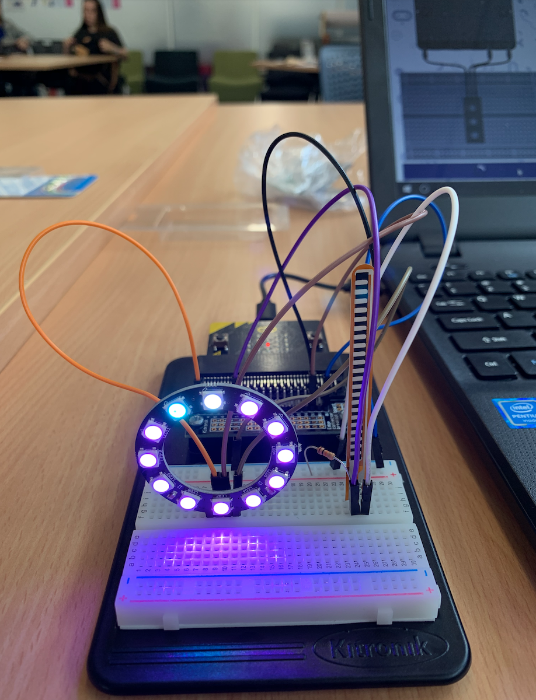

# Inventor Kit Experiments

*Markdown reference: https://guides.github.com/features/mastering-markdown/*

## Instructions ##

*For a selection of 5 inventor kit experiments that you choose, fill out the following sections.

### Experiment name ###

Input, Output Experiment: Pressure sensor and LED's

#### Photo of completed project ####

Here you can see the both the finalised experiment as well as the code completed on the microbit website.

#### Reflection ####

In this experiment, something new to me was building on the breadbaord, as I have no expeirence with this in the past I found it both challenging as well as fulfilling when getting something working. The build itself was nothing too hard, I simply had to connect the LED strip to the microbit via the 3volt connection and connect the pressure sensor to the ground. While I was building the breadboard, Keenan was writing up the code using the microbit website. Doing this he dictated that when downloaded the microbit would be stuck on a forever loop with the neopixel flashing the LED lights. A secondary piece of code was made up for the pressure sensor that would make the sensor operate as a method of changing the LED's colour. When pushed forward or back the colour of the LED strip would change. This experiment was a really positive learning experience as I got to start working on harder tasks I am not really used to doing. I struggled initially with how to even begin making the piece but after recieving some help by peers who had previously worked with technology like this I began to get the hang of things. I'm hoping by the end of the course I will be able to build much more complex and intricate pieces and look back at this as a starting point.

This experiment could be the basis of a real world application such as an art instillation. With larger version's of this built viewer's could enter a room with these pressure sensors and depending on the pressure or the angle they are pushed at could change the rooms colour. This could even be applied with sound to make more of a complex project (Something I would like to look at in the future). We've seen many similar projects within the first two weeks so something like this isn't that out of the ordinary and could easily be completed with the knowledge. Another application could be for that of a game or other entertainment media for example, depending how hard you could push the sensor colours would flash to the player almost reminiscent of a punch machine found in arcades where the player is judged on how much pressure is applied with a punch with numerical point values. You could simply factor out the points and replace them with colours. Say Red being the best and Blue being the worst.

### Experiment name ###

LED Sound 

#### Photo of completed project ####
In the code below, replace imagemissing.jpg with the name of the image, which should be in the kitexperiments folder.

Here you can see the completed work as well as the foundation code for it to work 

#### Reflection ####

In this experiment, something new to me was or something I learned was how to connect both a LED and speaker up together. The project was similar in nature to the previous with an LED being set up and coded, this however, had a small speaker hooked up that would play sound between the breaks in the light. The project was easy enough to build. I initially had issues getting the speaker to work but I had simply hooked the wrong pins up. With the small change the piece worked perfectly. The project started as the LED so I coded the first sequence to be a three second hold on when the microbit was turned on and then flash on for one second and off for one second. The next step was coding the speaker to play a note whenever the light was off. Again, this was easy enough and the only issues I encountered were in regard to the pins and breadboard but I am slowly becoming more comfortable with using the microbit kit and making these kinds of experiments. 

This experiment could be the basis of a real world application such as setting up a telegraph sounder to send morse code between people. This could be a fun way to help learn coding and get the machine to transmit messages to be deciphered. Another example of how the technology could be used is in marketing. Having a large scale version of something like this could display images or text with LED lights and have sound to accompany these putting messages out for an audience. 

### Experiment name ###

Motor Fan

#### Photo of completed project ####

Pictured here is the fan experiment and the corresponding coding 

#### Reflection ####

In this experiment, something new to me was or something I learned was how to use and code a motor with a fan. The concept was perfect for me as I wanted to use something like this in my own project towards the end of the trimester. The experiment consists of a motor with a fan attached hooked up to the microbit. The coding tells the fan to alternate between it's fastest speed and slowest speed. I want to use this motor setup with my final drawing machine, having a 3D printed piece in place of the fan and a knob to change the speed. The idea is based upon a rotarty tattoo machine however, instead of needles the machine will have a pen in place being pushed up and down to create dots. This would make it easier to complete stippled works comprising only of dots, a style I myself will often use for drawing. This simple experiment holds a lot of weight in my studies of micro computers and I will be choosing to work more with this piece of equipment in the coming weeks. 

This experiment could be the basis of a real world application such as the project I have spoken above, which I plan on making. Another example could be a mass production of these motor fans for an audio installation. The class did not get to complete this task however, my group did so I know how this piece works. A lamp shade is put over the fan as well as a cup and ping pong ball which allows for the ball to move around creating noises against the shade. When done on a large scale the experiment can make large and beautiful or annoying amounts of sound depening upon how you hear it.

### Experiment name ###

Buttons

#### Photo of completed project ####

Pictured here is the button experiment and the corresponding coding 

#### Reflection ####

In this experiment, something new to me was or something I learned was how to use and code buttons with the BBC microbit. This was one of the first experiments in the booklet and gives a basic description of how the experiment and code correlate as well as a description of how the circuit works. These easier experiments were a nice way to get myself used to building with the microbit as well as developing an understanding of exactly what is happening and why. I feel more comfortable completing these earlier experiments at this point because I know what I'm doing and understand the concepts. Something I didn't expect myself to be learning but am quite greatful I have this knowledge 

This experiment could be the basis of a real world application such as on a controller with each button having different corresponding lights or even taking it a step further and having sounds. The first thing that came to mind with the button was something like a buzzer from a game show, where when hit the button would make a loud noise indicating the player wanted to answer. This could easily use lights as well combining the two ideas. 

### Experiment name ###

Piezo Buzzer

#### Photo of completed project ####

Pictured here is the piezo buzzer experiment and the corresponding coding 

#### Reflection ####

In this experiment, something new to me was or something I learned was how to control the tone of a piezo buzzer and use the music blocks more. The experiment consists of wiring up a piezo buzzer to ground and pin zero, each button on the microbit will play a corresponding tone. This taught me how I could use the buzzer for musical application or purely for applying sound to the action of pressing various buttons. This idea could come into use with other concepts like creating a game with the microbit and having the buttons play various noises for the actions. 

This experiment could be the basis of a real world application such as coding sounds for toys such as sound boards for toddlers. Each button is coded to make a corresponding sound. In this example you may press a button with a picture of a cow and the button would make a moo noise to indicate that is what the cow does. Toys like this use a similar but more complex version of this simple experiment. Novelty toys such as "NO" buttons follow the same logic, making noise when the button is pressed. You could add depth to this with a pressure sensor and have the sensor play different noises depending upon how much pressure is applied. I feel this could be accomplished with the knowledge I have now as 2 experiments I have completed have taught me these skills.

