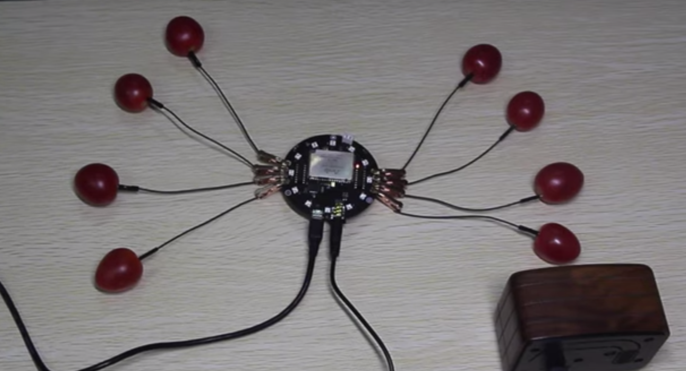
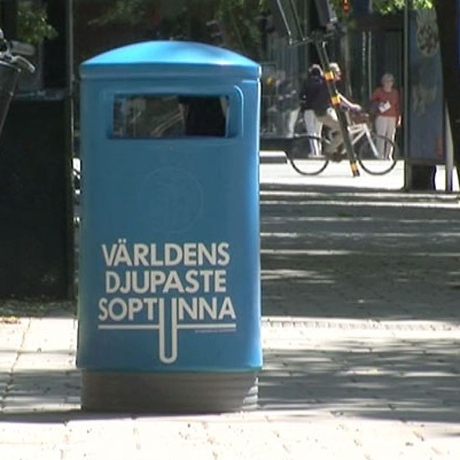
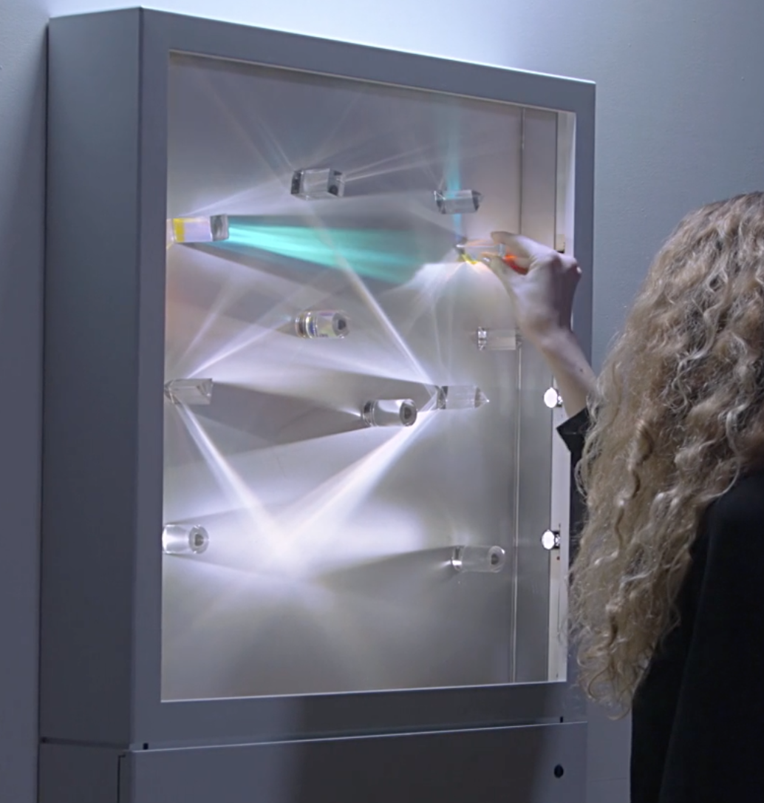
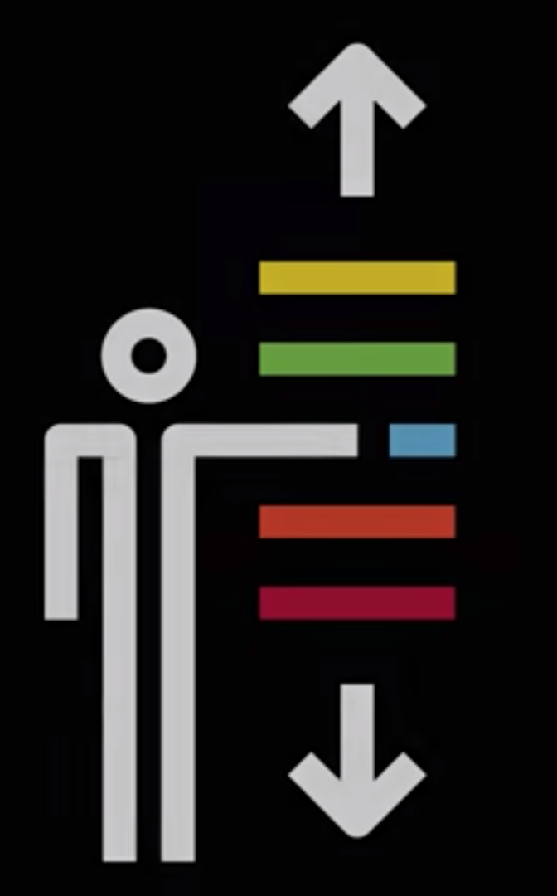
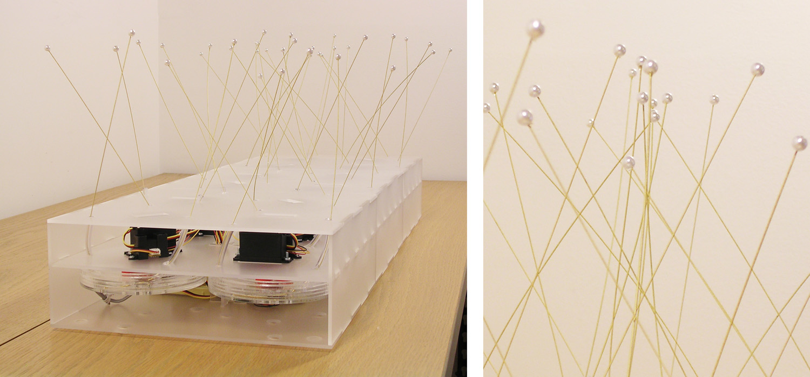
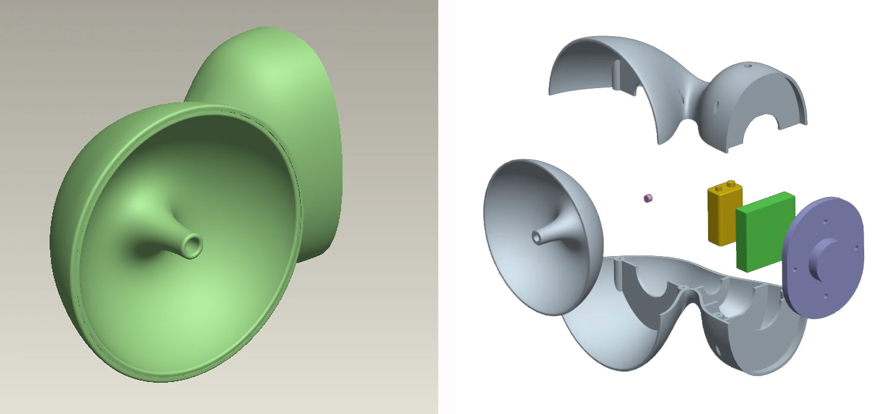

# Assessment 1: Replication project

*Fill out the following workbook with information relevant to your project.*

*Markdown reference:* [https://guides.github.com/features/mastering-markdown/](http://guides.github.com/features/mastering-markdown/)

## Replication project choice ##
Banana Kyboard

## Related projects ##
*Find about 6 related projects to the project you choose. A project might be related through  function, technology, materials, fabrication, concept, or code. Don't forget to place an image of the related project in the* `replicationproject` *folder and insert the filename in the appropriate places below. Copy the markdown block of code below for each project you are showing, updating the number* `1` *in the subtitle for each.*

### Related project 1 ###
Tomato Piano
http://www.seeedstudio.com/blog/2016/09/19/respeaker-tomato-piano-with-arduino/

This project is very similar to the Banana keyboard as it uses tomatoes to replicate a piano. The project works by having a total of 8 tomatoes the 8 touch sensors on ReSpeaker. Each cherry tomato represents a key to the music note, starting from the ‘do’ to the ‘ti’. While this is very similar to the banana keyboard project it works on a larger scale and uses the arduino micro computer instead of the microbit. Having 8 tomatoes hooked up with each representing different tones also allows for the user to play mussic with the project too, something that could be considered for the replication. By having each piece of fruit represent a different tone the project could be made more complex rather than the simple original version and would allow for far more interaction. The project can be done with any object that conducts electricity too so you could use a variety of different fruits, or even other objects such as spoons, coins or conductive ink.

### Related project 2 ###
The world’s deepest bin
https://medium.com/@oskarlindskog/10-sound-installations-that-inspire-and-create-connection-73eabd5ce075

This installation was developed to get people putting more rubbish into bins and uses a basic sensor and speaker makeup. The idea is that when rubbish is put into the bin the sensor goes off playing audio through the speaker. The audio is of an object falling and eventually hitting the bottom of the bin, making it seem as though the piece of rubbish was falling deeper and deeper into the bin. This project is a fun idea and is doing some good. The premise is simple yet effective and some of the ideas could be applied to future projects.

### Related project 3 ###
Lenses
https://medium.com/@oskarlindskog/10-sound-installations-that-inspire-and-create-connection-73eabd5ce075

Lenses is an interactive insallation designed by the New York creative agency "Hush". The project is made up of various shaped objects that when bent, moved and changed  the colors and angles of the light trigger sound changes. This project uses light sensors and changes upon the colour of refracted light to create different sounds making each interaction different from the last. I found this project interesting because it shows what can be accomplished with a very simple idea, the agency have created a very interactive project with bare bones technology done well and I think this is something that can be learned from. I feel this piece also had a soft spot in my heart beacuse I enjoy intallations of this kind because they make an exhibition feel more intimate with each member of the crowd being able to have their own interaction with the project. Creating interactive pieces such as Lenses is something I could really see myself doing in the future.

### Related project 4 ###
Lines
https://www.youtube.com/watch?v=hP36xoPXDnM

Lines is an interactive sound instllation created by Swedish composer Anders Lind in 2016. Within the project lines are attached to the wall, on the floor and hanging from the ceiling in combination with sensors and electronics creating three musical instruments. Lines wanted to form a new way of exploring music through an interctive room. The project uses simple technology effectively creating a very interesting look into muscial exploration. On the surface the idea seems very simple but the work put in behind the scenes and the intricacies of the sounds matching with colours make it a very complex exhibition. Like many of the previous examples I have chosen to include Lines is extremely effective in creating an interactive fun expierence and I find this to be inspiring as an artist myself and makes me want to explore this avenue of design more and more.

### Related project 5 ###
Cousteau
https://www.arjodesign.com/#/cousteau/

Cousteau is a kinetic interactive sculpture. The project was a means of using simple movements to suggest that technology might possess its own life force. "Through a network of sensors, the sculpture monitors its surroundings, reacting to ambient activity, and a user’s proximity."(ArjoDesign 2019) The project itself is not really a sound installation nor does it reallt have anything to do with the banana keyboard however, I was drawn to the project. In a way I do see it as relating audio-wise because the servo-motors of the piece create this loud but soothing noise, almost like a large swarm of bugs which I found very interesting. I feel it added a whole new layer of life to the piece as opposed to if it were operating the same in complete silence. I find the idea of ambient noise being created on a large scale like within this project, other examples similar are machines making sounds similar to that of rain falling. I think it's just something about hearing such a natural sound coming from machines that is very strange.

### Related project 6 ###
TOTALLY AMAZING MUTANT EARS
https://www.arjodesign.com/#/ears/

Totally Amazing Mutant Ears are sound-collecting headphones that turn every day sounds into completely new and unique aural experiences for the user. The sounds are made via mixing of four different digital distortion modes, these include: reverb, echo, metallic, pitch-shifting effect. The user no longer hears everyday sounds but is treated to hearing things out of this world as what they know is warped and changed. The idea of the project is to give the user the sense that they were dealing with martians or were on another planet or underwater. The piece is made of headphones, a digital sound processor and microphone all combined with added plastic parts to keep it all together. Such a fun idea could be marketed as a childrens toy or created on a large scale of an exhibition installation.

## Reading reflections ##
*Reflective reading is an important part of actually making your reading worthwhile. Don't just read the words to understand what they say: read to see how the ideas in the text fit with and potentially change your existing knowledge and maybe even conceptual frameworks. We assume you can basically figure out what the readings mean, but the more important process is to understand how that changes what you think, particularly in the context of your project.*

*For each of the assigned readings, answer the questions below.*

### Reading: Don Norman, The Design of Everyday Things, Chapter 1 (The Psychopathology of Everyday Things) ###

*What I thought before: Describe something that you thought or believed before you read the source that was challenged by the reading.*

*What I learned: Describe what you now know or believe as a result of the reading. Don't just describe the reading: write about what changed in YOUR knowledge.*

*What I would like to know more about: Describe or write a question about something that you would be interested in knowing more about.*

*How this relates to the project I am working on: Describe the connection between the ideas in the reading and one of your current projects or how ideas in the reading could be used to improve your project.*

### Reading: Chapter 1 of Dan Saffer, Microinteractions: Designing with Details, Chapter 1 ###

*What I thought before: Describe something that you thought or believed before you read the source that was challenged by the reading.*

*What I learned: Describe what you now know or believe as a result of the reading. Don't just describe the reading: write about what changed in YOUR knowledge.*

*What I would like to know more about: Describe or write a question about something that you would be interested in knowing more about.*

*How this relates to the project I am working on: Describe the connection between the ideas in the reading and one of your current projects or how ideas in the reading could be used to improve your project.*

### Reading: Scott Sullivan, Prototyping Interactive Objects ###

*What I thought before: Describe something that you thought or believed before you read the source that was challenged by the reading.*

*What I learned: Describe what you now know or believe as a result of the reading. Don't just describe the reading: write about what changed in YOUR knowledge.*

*What I would like to know more about: Describe or write a question about something that you would be interested in knowing more about.*

*How this relates to the project I am working on: Describe the connection between the ideas in the reading and one of your current projects or how ideas in the reading could be used to improve your project.*

## Interaction flowchart ##
*Draw a flowchart of the interaction process in your project. Make sure you think about all the stages of interaction step-by-step. Also make sure that you consider actions a user might take that aren't what you intend in an ideal use case. Insert an image of it below. It might just be a photo of a hand-drawn sketch, not a carefully drawn digital diagram. It just needs to be legible.*

## Process documentation

*In this section, include text and images that represent the development of your project including sources you've found (URLs and written references), choices you've made, sketches you've done, iterations completed, materials you've investigated, and code samples. Use the markdown reference for help in formatting the material.*

*This should have quite a lot of information!*

*There will likely by a dozen or so images of the project under construction. The images should help explain why you've made the choices you've made as well as what you have done. Use the code below to include images, and copy it for each image, updating the information for each.*

*Include screenshots of the code you have used.*

## Project outcome ##

*Complete the following information.*

### Project title ###

### Project description ###

*In a few sentences, describe what the project is and does, who it is for, and a typical use case.*

### Showcase image ###

*Try to capture the image as if it were in a portfolio, sales material, or project proposal. The project isn't likely to be something that finished, but practice making images that capture the project in that style.*

### Additional view ###

*Provide some other image that gives a viewer a different perspective on the project such as more about how it functions, the project in use, or something else.*

### Reflection ###

*Describe the parts of your project you felt were most successful and the parts that could have done with improvement, whether in terms of outcome, process, or understanding.*

*What techniques, approaches, skills, or information did you find useful from other sources (such as the related projects you identified earlier)?*

*What ideas have you read, heard, or seen that informed your thinking on this project? (Provide references.)*

*What might be an interesting extension of this project? In what other contexts might this project be used?*
